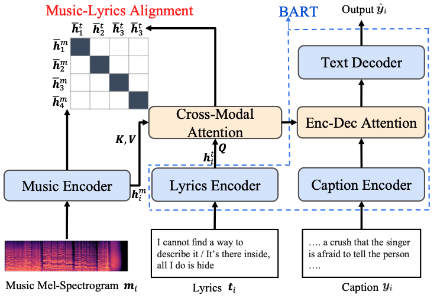

# ALCAP
In this paper we propose to learn the alignment between audio and lyrics using contrastive learning to achieve higher-quality music captions.

## Framework




## Data Download
For copyright considerations we are only able to provide [the song interpretation dataset](https://zenodo.org/records/6519264) but not the netease dataset.
1. Download the [metadata](https://drive.google.com/file/d/1N4X3P_iGEV-qXiOIhEU2wstiT-fodj0b/view?usp=sharing) to *data/music4all*.
2. Download the [song waveforms](https://drive.google.com/file/d/1N4J1pJZ284j9Pgi48uQxUoRWrJfwggCK/view?usp=sharing) to *data/music4all/audios*.
3. (Optional) Download the [song embeddings](https://drive.google.com/file/d/1N2GliV3BpiuW3y2ea_Oi84JB25OBi47S/view?usp=sharing) to *data/music4all/audios*. If not downloaded the code will generate the embeddings from scratch.

## Model Training
```angular2html
python run_train.py
```
Try different corpora and random seeds.


## Inference
```angular2html
python run_eval.py
```
Try different corpora and random seeds.


## Citation
```bibtex
@inproceedings{he2023alcap,
  title={ALCAP: Alignment-Augmented Music Captioner},
  author={He, Zihao and Hao, Weituo and Lu, Wei-Tsung and Chen, Changyou and Lerman, Kristina and Song, Xuchen},
  booktitle={Proceedings of the 2023 Conference on Empirical Methods in Natural Language Processing},
  pages={16501--16512},
  year={2023}
}
```